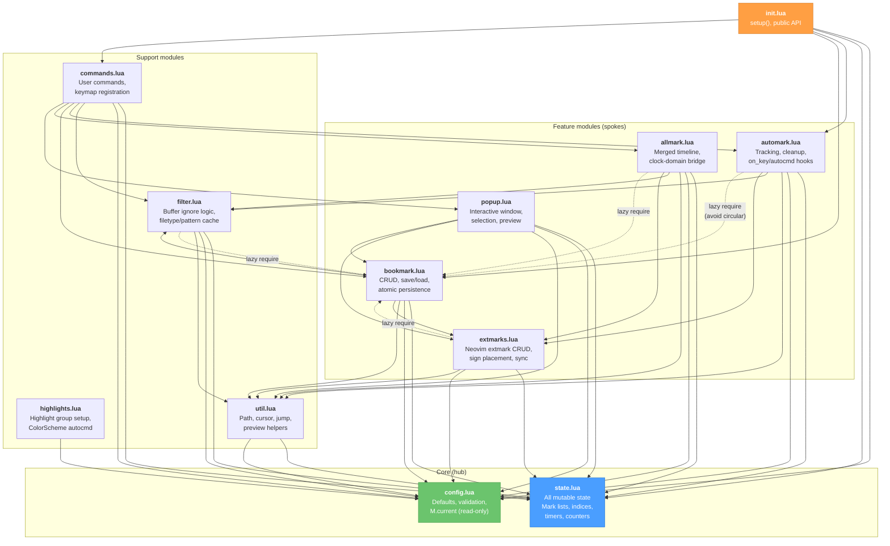
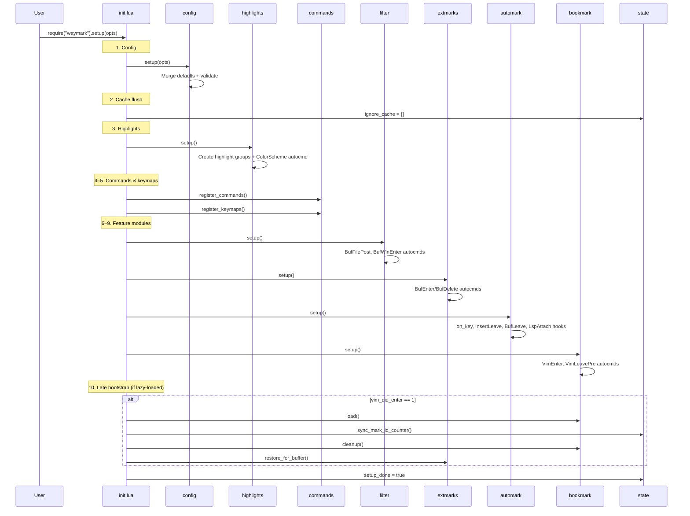
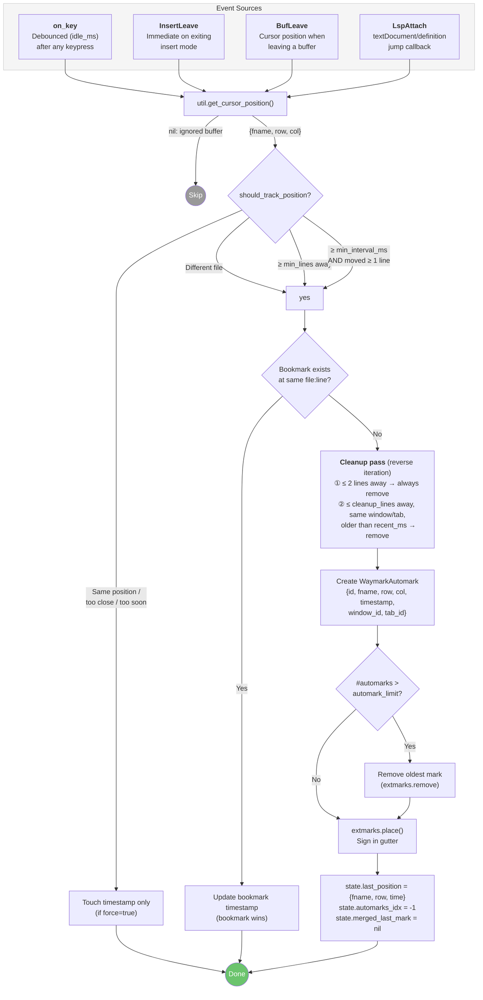
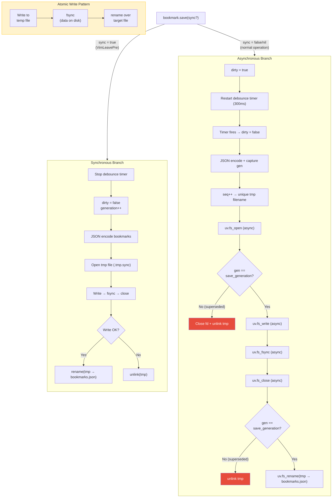
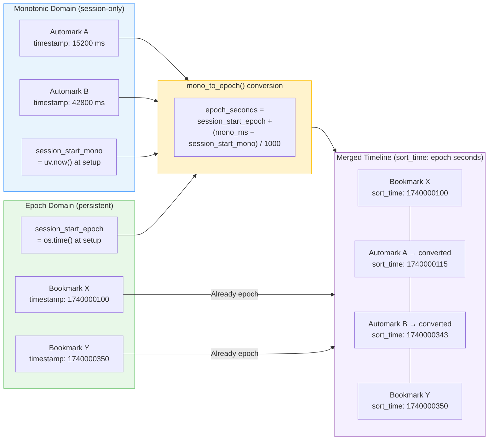
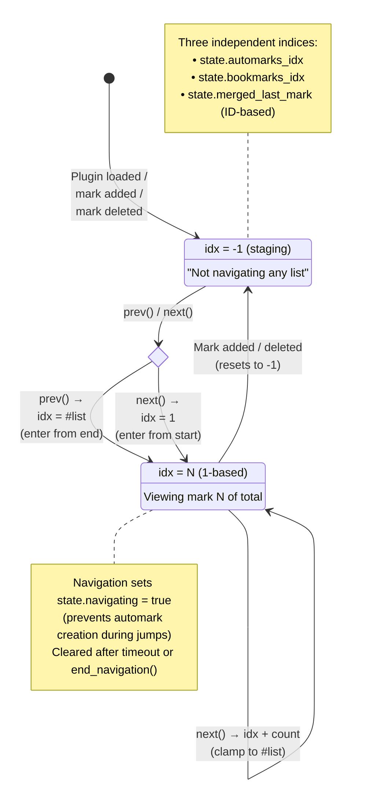
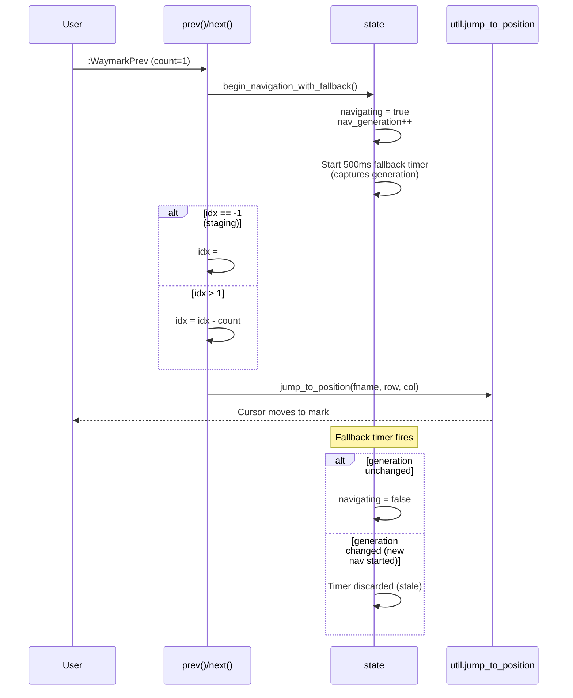
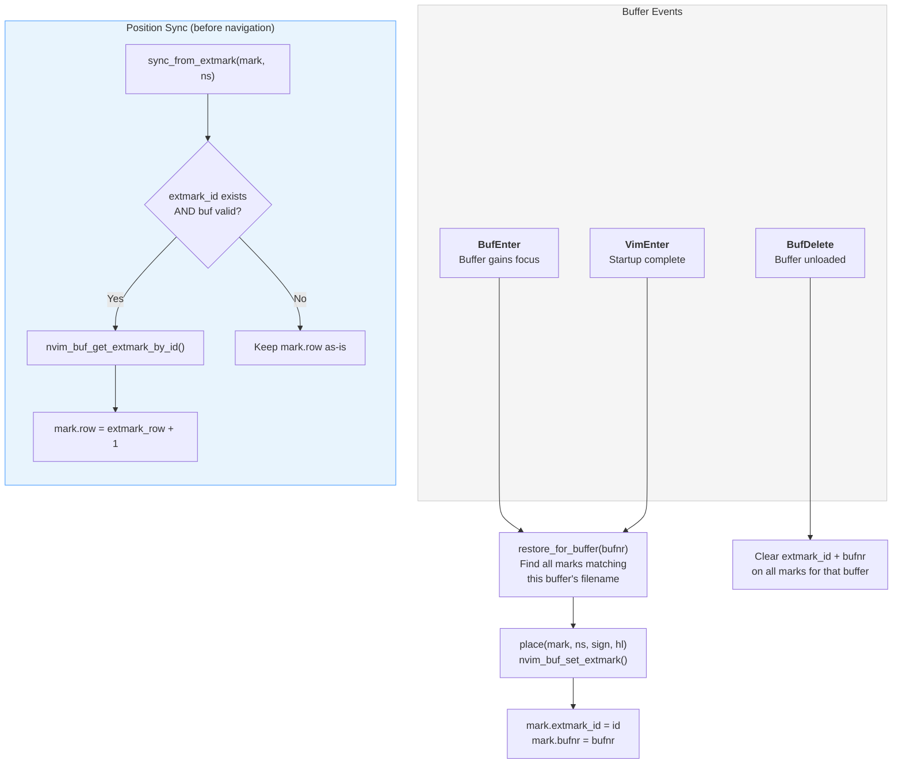
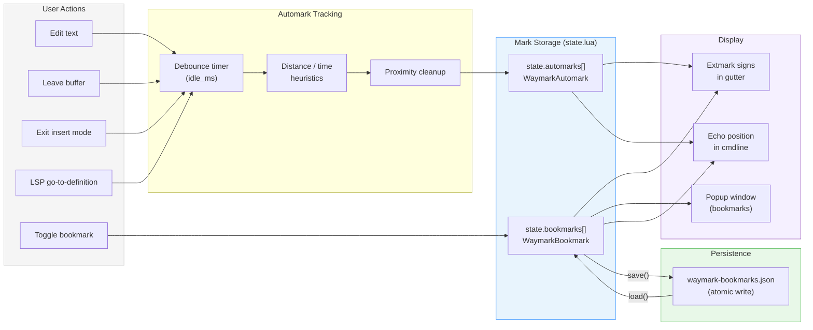
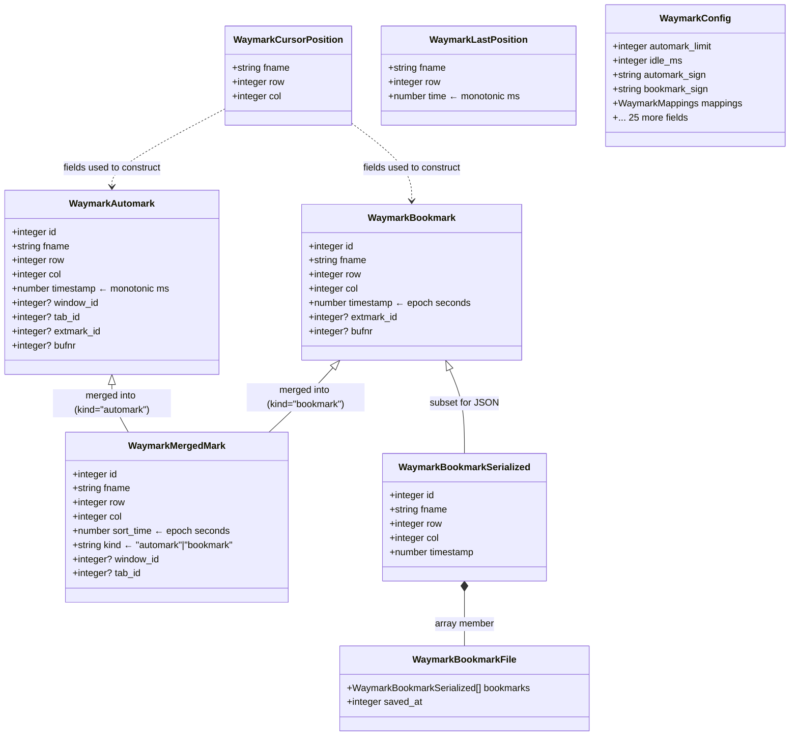

# waymark.nvim — Architecture

Visual reference for contributors. All diagrams use [Mermaid](https://mermaid.js.org/) and render on GitHub natively.

---

## Module Dependency Graph

Hub-and-spoke: `state` is the shared mutable hub, `config` is read-only shared config. No module requires another module's internal locals — communication happens through `state` fields or public API calls.

> **Key constraint:** Dashed lines are lazy `require()` calls inside functions (not top-level) to break circular dependencies. Every dashed arrow points to `bookmark` — this is the only module that gets lazy-required.

---

## Setup Sequence

`init.setup(opts)` initializes modules in dependency order. Steps are numbered to match the comments in `init.lua`.

---

## Automark Tracking Flow

Automarks are created by four event sources. Each goes through the same `add()` pipeline with distance/time heuristics and a cleanup pass.

---

## Bookmark Save Pipeline

Two branches: synchronous (VimLeavePre) and asynchronous (normal operation). Both use atomic writes. The async branch adds generation counting to abandon superseded writes.

> **Why generation counting?** Rapid edits produce multiple save requests. Without generation checks, an older async write completing after a newer one would overwrite fresher data. Each async callback verifies its captured generation still matches the current one — if not, it discards its temp file and exits.

---

## Allmark Timeline: Dual Clock Domain Bridge

Automarks use monotonic milliseconds (immune to NTP/DST), bookmarks use epoch seconds (survive restarts). The allmark timeline unifies them using session anchors recorded at startup.

> **Deduplication:** Before merging, bookmark positions are recorded in a `fname\0row` lookup set. Automarks at the same file:line as a bookmark are suppressed — the bookmark "wins" since it's persistent.

---

## Navigation State Machine

All three subsystems (automark, bookmark, allmark) share the same navigation pattern. The `-1` staging sentinel means "not navigating yet."

---

## Extmark Lifecycle

Extmarks (sign column indicators) are placed, synced, and restored as buffers load and unload. `extmarks.lua` is the sole authority — no other module touches `nvim_buf_set_extmark` directly.

> **Why sync before navigate?** When the user edits text, Neovim moves extmarks with the text automatically. But the mark struct's `.row` field is stale. `sync_from_extmark` reads the extmark's actual position back into the mark before any jump, ensuring navigation goes to the right line.

---

## Data Flow Summary

End-to-end: from user action to persisted state.

---

## Type Hierarchy

All `@class` definitions and where they're produced and consumed.

