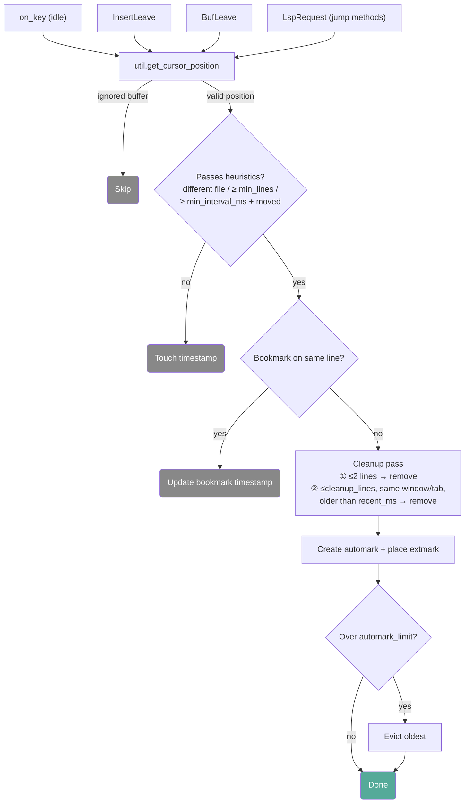
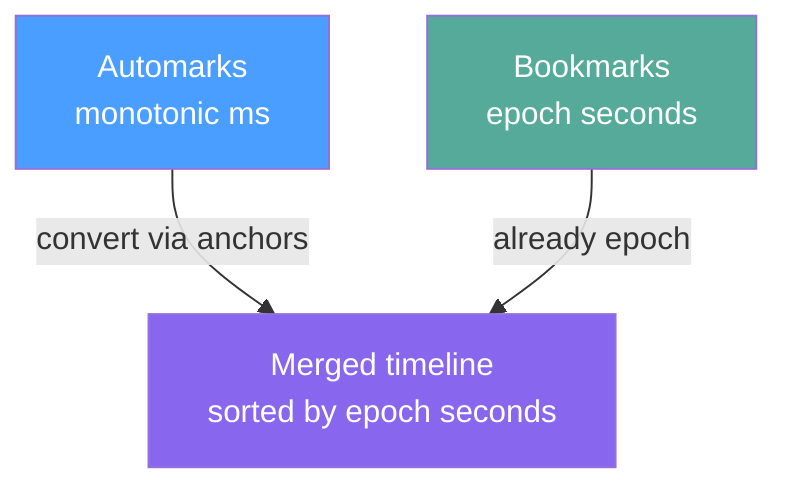
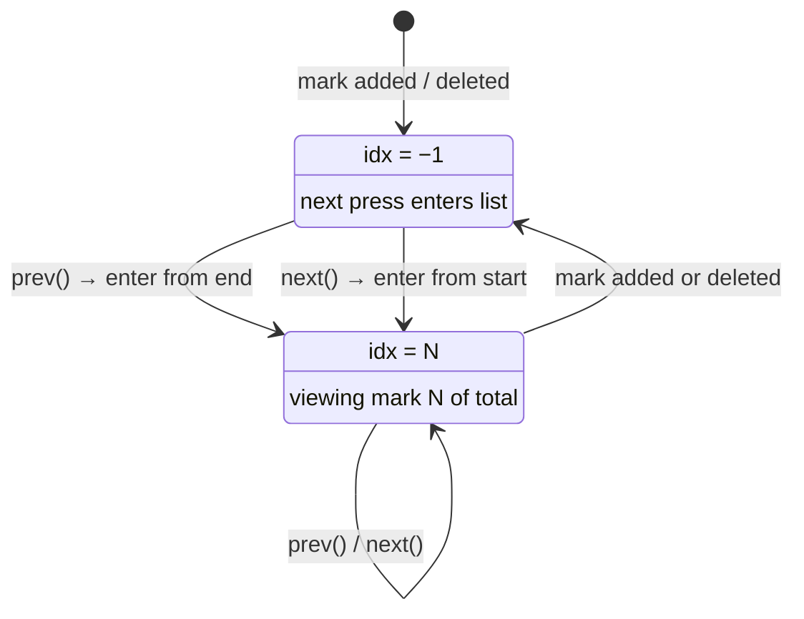
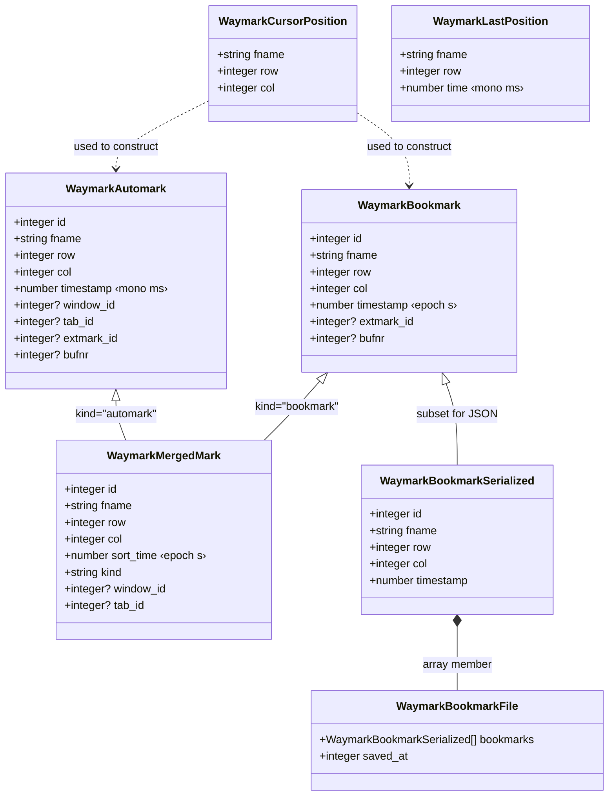

# waymark.nvim — Architecture

Reference for contributors. Diagrams use [Mermaid](https://mermaid.js.org/) and render on GitHub natively.

---

## Overview

Waymark's architecture is hub-and-spoke. `state.lua` holds all mutable runtime
state — mark lists, timers, navigation indices, counters. `config.lua` holds the
validated read-only configuration. Every feature module reads and writes `state`
and reads `config`; no module imports another module's internal locals. The only
exception is `bookmark.lua`, which four other modules lazy-require inside
function bodies (never at the top level) to break what would otherwise be
circular dependencies.

---

## Module Inventory

Nearly every module depends on `state`, `config`, and `util` — those are
omitted below. Only non-obvious or structurally interesting dependencies are
listed.

| Module | Owns | Notable dependencies |
|---|---|---|
| **init.lua** | `setup()` orchestration, public API façade | Requires all modules directly |
| **config.lua** | Default values, merge logic, validation | None beyond stdlib |
| **state.lua** | Mark lists, indices, timers, namespaces, navigation helpers | None beyond stdlib |
| **automark.lua** | Tracking triggers, distance/time heuristics, cleanup pass | `filter`, `extmarks`; lazy-requires `bookmark` |
| **bookmark.lua** | CRUD, atomic JSON persistence, toggle, navigation | `filter`, `extmarks` |
| **allmark.lua** | Merged timeline, clock-domain bridge | `filter`, `extmarks`; lazy-requires `bookmark` |
| **popup.lua** | Interactive floating window, selection, reorder | `extmarks`, `bookmark` |
| **extmarks.lua** | All `nvim_buf_set_extmark` / `del_extmark` calls | Lazy-requires `filter`, `bookmark` |
| **commands.lua** | `:Waymark*` user commands, keymap registration | `filter`, `automark`, `bookmark`, `allmark`, `popup` |
| **filter.lua** | Buffer ignore logic, filetype/pattern cache, rename handling | Lazy-requires `bookmark` |
| **highlights.lua** | Highlight group definitions, `ColorScheme` autocmd | — |
| **util.lua** | Path normalization cache, cursor helpers, jump, flash, preview | — |
| **health.lua** | `:checkhealth waymark` diagnostics | — |

> **Lazy requires:** Four modules (`automark`, `allmark`, `extmarks`, `filter`)
> call `require("waymark.bookmark")` inside function bodies rather than at the
> top level. This is the only circular-dependency escape hatch in the codebase.

---

## Setup Sequence

`init.setup(opts)` initializes modules in dependency order. Each step depends on
the ones above it.

1. **config.setup(opts)** — Merge user options into defaults, validate all
   values. Everything else reads `config.current`, so this must come first.
2. **state.ignore_cache = {}** — Flush the buffer-ignore cache from any
   previous `setup()` call.
3. **highlights.setup()** — Define highlight groups and register the
   `ColorScheme` autocmd. Must precede command/keymap registration because sign
   placement references these groups.
4. **commands.register_commands()** — Create all `:Waymark*` user commands
   (idempotent).
5. **commands.register_keymaps()** — Bind keymaps from `config.current.mappings`.
   Cleans up keymaps from any previous `setup()` call first.
6. **filter.setup()** — Register `FileType`, `BufWinEnter`, `BufDelete`, and
   `BufFilePost` autocmds for cache invalidation and buffer rename handling.
7. **extmarks.setup()** — Register `BufEnter`, `BufUnload`, `BufDelete`, and
   `BufWritePost` autocmds for the extmark lifecycle.
8. **automark.setup()** — Register `on_key` handler, `InsertLeave`, `BufLeave`,
   and `LspRequest` autocmds.
9. **bookmark.setup()** — Register `VimEnter` and `VimLeavePre` autocmds.
10. **Late bootstrap** — If `vim.v.vim_did_enter == 1` (lazy-loaded plugin),
    immediately load bookmarks, sync the ID counter, clean up stale entries, and
    restore extmarks for the current buffer.

---

## Automark Tracking Flow

Automarks are created by four event sources. Each feeds into the same `add()`
pipeline.



---

## Bookmark Save Pipeline

Bookmarks are saved to `~/.local/share/nvim/waymark-bookmarks.json`. Both
branches use the same atomic write pattern:


Readers never see a partially-written file because rename is atomic on POSIX
filesystems.

**Synchronous branch** (`VimLeavePre`): stops the debounce timer, encodes JSON,
writes the temp file, fsyncs, renames. Blocking — guarantees data is saved
before Neovim exits.

**Asynchronous branch** (normal operation): marks the bookmarks as dirty, then
restarts a 300ms debounce timer. When the timer fires, it captures the current
*save generation* counter, then runs the open → write → fsync → close → rename
chain using `uv.fs_*` async calls. Each callback checks whether the captured
generation still matches the current one. If a newer save was requested in the
meantime, the in-flight write discards its temp file and exits — preventing a
stale write from overwriting fresher data.

---

## Allmark Timeline: Dual Clock Domain

Automarks use monotonic milliseconds (`vim.uv.now()`) — immune to NTP skew,
daylight saving, and manual clock changes, but meaningless across sessions.
Bookmarks use epoch seconds (`os.time()`) — meaningful after restart.

The merged timeline converts automark timestamps into epoch space using session
anchors captured at startup:

```
epoch_seconds = session_start_epoch + (mono_ms − session_start_mono) / 1000
```



Before merging, bookmark positions are recorded in a `fname\0row` set.
Automarks at the same file and line are suppressed — the bookmark wins since
it's the persistent mark.

---

## Navigation Model

All three subsystems share the same navigation pattern. The `−1` staging
sentinel means "not currently navigating any list."



Three independent indices track position in each list:

- `state.automarks_idx` — integer index into `state.automarks`
- `state.bookmarks_idx` — integer index into `state.bookmarks`
- `state.merged_last_mark` — mark ID (not index), looked up on each navigation
  since the merged list is rebuilt every time

Navigation sets `state.navigating = true` to suppress automark creation during
jumps. A 2-second generation-counted fallback timer clears the flag if
`end_navigation()` is never called (e.g. due to an error). The generation check
prevents a stale timer from clearing `navigating` after a *newer* navigation
has started.

---

## Extmark Lifecycle

`extmarks.lua` is the sole authority for all Neovim extmark operations. No other
module calls `nvim_buf_set_extmark` or `nvim_buf_del_extmark` directly.

| Event | Action |
|---|---|
| **BufEnter** | Restore extmarks for all marks whose filename matches the entering buffer (deferred 50ms to let the buffer fully load). |
| **BufUnload** | Sync extmark positions back into mark structs, then clear `extmark_id` / `bufnr` references. |
| **BufDelete** | Same handler as BufUnload. Both are registered because BufUnload may not fire in all `:bwipeout` scenarios. Double-firing is harmless since syncing an already-synced mark is a no-op. |
| **BufWritePost** | Full sync → deduplicate → restore cycle. Format-on-save can shift lines, causing two bookmarks to land on the same line. This cycle catches and resolves that. |
| **VimEnter** | Restore extmarks for bookmarks in the initial buffer after loading from disk. |
| **VimLeavePre** | Sync all extmark positions across all loaded buffers, deduplicate, then save bookmarks synchronously. |

> **Why sync before navigate?** When the user edits text, Neovim moves extmarks
> with the content automatically. But the mark struct's `.row` field is stale
> until `sync_from_extmark()` reads the extmark's current position back. Every
> navigation call syncs first so jumps land on the right line.

---

## Data Flow: Two Stories

**Automark creation (you stop typing for 3 seconds):**
`on_key` fires on each keypress, restarting the debounce timer. When the timer
finally fires (idle threshold reached), it checks you're in normal mode and in a
trackable buffer. `should_track_position()` compares the cursor against the last
recorded position using distance and time heuristics. If it passes, the cleanup
pass removes nearby stale automarks in the same window/tab, a new
`WaymarkAutomark` is appended to `state.automarks`, an extmark is placed in the
gutter, and if the list exceeds `automark_limit`, the oldest mark is evicted.
The mark exists only in memory — automarks are never persisted to disk.

**Bookmark toggle (you press the toggle key):**
`bookmark.toggle()` checks whether any automark or bookmark exists at the
current line. If something exists, it removes all marks on that line (automarks
from memory, bookmarks from memory and disk). If nothing exists, it creates a
new `WaymarkBookmark` with an epoch-seconds timestamp, inserts it into
`state.bookmarks`, places a gutter extmark, and triggers `save()`. The async
save pipeline debounces for 300ms, then atomically writes the JSON file. On next
startup, `VimEnter` loads the file back into `state.bookmarks` and restores
extmarks.

---

## Type Hierarchy

All `@class` definitions and where they're produced and consumed.


