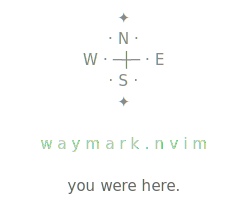

<p align="center">
  <picture>
    <source media="(prefers-color-scheme: dark)" srcset="./assets/waymark-banner-dark.svg" />
    <source media="(prefers-color-scheme: light)" srcset="./assets/waymark-banner-light.svg" />
    
  </picture>
</p>

<p align="left">
  <a href="https://github.com/pablosgraduation/waymark.nvim/actions/workflows/ci.yml">
    
  </a>
</p>

Position-tracking & navigation plugin for Neovim.

Waymark provides three complementary navigation subsystems that work alongside
(not replacing) Neovim's built-in jumplist and named marks:

| Subsystem | Description | Persistence |
|-----------|-------------|-------------|
| **Automark** | Automatic breadcrumbs on idle, InsertLeave, BufLeave, LSP jumps | Session only |
| **Bookmark** | User-placed persistent marks with interactive popup | JSON on disk |
| **Allmark** | Merged chronological timeline of both | — |

## Why waymark?

Automarks create a breadcrumb trail as you work, so no manual `:mark` placement
needed. Context cleanup prunes nearby duplicates while protecting recent marks,
keeping the list focused on meaningful positions. Bookmarks persist across
sessions using atomic writes (temp → fsync → rename), so your marks survive
crashes. An interactive popup lets you select, reorder, preview, and open
multiple bookmarks in vertical splits. Waymark coexists with `<C-o>`/`<C-i>`
and named marks rather than replacing them; it provides a parallel navigation
history with different heuristics tuned for "where have I been working?" rather
than "where did I jump from?".

## Requirements

- Neovim ≥ 0.10

## Installation

### vim.pack (Neovim ≥ 0.12)

```lua
vim.pack.add({
    "https://github.com/pablosgraduation/waymark.nvim",
})
require("waymark").setup()
```

### lazy.nvim

```lua
{
    "pablosgraduation/waymark.nvim",
    event = "VeryLazy",
    opts = {},
}
```

### packer.nvim

```lua
use {
    "pablosgraduation/waymark.nvim",
    config = function()
        require("waymark").setup()
    end,
}
```

### Manual

Clone into your Neovim packages directory:

```sh
git clone https://github.com/pablosgraduation/waymark.nvim \
  ~/.local/share/nvim/site/pack/plugins/start/waymark.nvim
```

## Setup

```lua
require("waymark").setup()           -- all defaults
require("waymark").setup({ ... })    -- override options
```

See `:help waymark-config` for the full options table.

### All options (defaults shown)

```lua
require("waymark").setup({
    automark_limit           = 15,
    automark_idle_ms         = 3000,
    automark_min_lines       = 5,
    automark_min_interval_ms = 2000,
    automark_cleanup_lines   = 10,
    automark_recent_ms       = 30000,

    jump_flash_ms            = 200,
    jump_flash_color         = "#4a4a4a",

    automark_sign            = "¤",
    bookmark_sign            = "※",
    automark_sign_color      = "#757575",
    bookmark_sign_color      = "#FFD700",

    popup_check_color        = "#E08070",
    popup_uncheck_color      = "#555555",
    popup_preview_color      = "#666666",
    popup_help_color         = "#555555",

    ignored_filetypes = {
        "neo-tree", "diffview", "spectre", "telescope",
        "help", "qf", "fugitive", "git", "toggleterm", "", "netrw",
    },
    ignored_patterns = {
        "neo%-tree", "diffview://", "spectre_panel", "Telescope",
        "^term://", "^fugitive://", "COMMIT_EDITMSG", "^oil://",
        "%.local/share/nvim/scratch/.*Scratch",
    },

    mappings = {
        add_bookmark       = "<leader>bb",
        delete_bookmark    = "<leader>bd",
        show_bookmarks     = "<leader>bl",
        prev_bookmark      = "<leader>bp",
        next_bookmark      = "<leader>bn",
        toggle_bookmark    = "<S-N>",
        goto_bookmark_1    = "<leader>b1",
        goto_bookmark_2    = "<leader>b2",
        goto_bookmark_3    = "<leader>b3",
        goto_bookmark_4    = "<leader>b4",
        goto_bookmark_5    = "<leader>b5",
        goto_bookmark_6    = "<leader>b6",
        goto_bookmark_7    = "<leader>b7",
        goto_bookmark_8    = "<leader>b8",
        goto_bookmark_9    = "<leader>b9",
        show_automarks     = "<leader>bal",
        purge_automarks    = "<leader>bac",
        prev_allmark       = "<C-b>",
        next_allmark       = false,
        prev_automark      = "[a",
        next_automark      = "]a",
    },
})
```

See `:help waymark-config-options` for descriptions of each option.

## Default Keymaps

| Key | Action |
|-----|--------|
| `<leader>bb` | Add bookmark |
| `<leader>bd` | Delete bookmark |
| `<leader>bl` | Show bookmarks popup |
| `<leader>bp` / `<leader>bn` | Prev / Next bookmark |
| `<S-N>` | Toggle bookmark |
| `<leader>b1`–`<leader>b9` | Jump to bookmark N |
| `[a` / `]a` | Prev / Next automark |
| `<C-b>` | Previous allmark (merged timeline) |
| `<leader>bal` | Show automarks |
| `<leader>bac` | Purge automarks (deleted files) |
| _(unbound)_ | Next allmark. Set `next_allmark` in `mappings` to enable |

Set `mappings = false` in setup to disable all keymaps.

## Architecture

```
lua/waymark/
├── init.lua        Public API + setup() orchestrator
├── config.lua      Default configuration, validation, merge
├── state.lua       Shared mutable state (marks, timers, indices)
├── highlights.lua  Highlight group definitions
├── util.lua        Path normalization, jump, flash, previews
├── filter.lua      Buffer ignore logic + cache
├── extmarks.lua    Extmark CRUD, sync/restore lifecycle
├── automark.lua    Automark add, cleanup, tracking, navigation
├── bookmark.lua    Bookmark CRUD, persistence, navigation
├── allmark.lua     Merged timeline navigation
├── popup.lua       Interactive bookmarks floating window
├── commands.lua    User commands + keymap registration
└── health.lua      :checkhealth waymark
```

`state.lua` is the central hub: modules communicate through shared state rather
than requiring each other, which prevents circular dependencies. Automarks use
monotonic timestamps (`vim.uv.now()`), bookmarks use epoch seconds (`os.time()`),
and the allmark timeline bridges the two clock domains via session anchors that
convert automark times into epoch space for unified sorting. `extmarks.lua` is
the authority for mark sign extmark operations (place, remove, sync,
and restore), so sign management is never scattered across modules. The only
exception is `util.flash_line()`, which manages its own short-lived line
highlight in a separate namespace.

See [ARCHITECTURE.md](ARCHITECTURE.md) for visual diagrams of the module
dependency graph, save pipeline, clock domain bridge, and navigation state
machine.

## Highlight Groups

| Group | Purpose |
|-------|---------|
| `WaymarkAutomarkSign` | Automark gutter sign |
| `WaymarkAutomarkNum` | Automark line number |
| `WaymarkBookmarkSign` | Bookmark gutter sign |
| `WaymarkBookmarkNum` | Bookmark line number |
| `WaymarkFlash` | Jump landing flash (full-line background) |
| `WaymarkPopupCheck` | Checked item in popup |
| `WaymarkPopupUncheck` | Unchecked item in popup |
| `WaymarkPopupSign` | Bookmark sign character in popup |
| `WaymarkPopupPreview` | Line preview text in popup |
| `WaymarkPopupHelp` | Help text at bottom of popup |

Colors are configurable via setup options (`automark_sign_color`,
`bookmark_sign_color`, etc.). Groups are reapplied automatically on
`ColorScheme` events, so theme changes are handled without intervention.

## Health Check

```vim
:checkhealth waymark
```

For detailed internal state, use `:WaymarkDebug` to dump mark counts,
positions, and extmark IDs.

## Development

```sh
./scripts/test.sh              # run full test suite (requires nvim)
./scripts/test.sh test_config  # run a single test file
./scripts/lint.sh              # luacheck
./scripts/format.sh            # stylua (--check for CI mode)
```

Tests use plenary.nvim, which is auto-bootstrapped on first run.

## License

MIT
